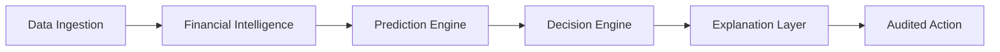

# Smart Income Buffer

> **Intelligent Cash Flow Stabilization & Reserve Management Platform for Irregular Earners and Gig Workers**

[](https://sure-savings-web-pss8.onrender.com/)
[](https://fastapi.tiangolo.com)
[](https://nextjs.org)
[](https://www.postgresql.org)
[](https://www.typescriptlang.org)
[](https://tailwindcss.com)

---

### 🌐 Live Production Deployment

- **🚀 Live Web Application**: [https://sure-savings-web-pss8.onrender.com/](https://sure-savings-web-pss8.onrender.com/)
- **⚡ Backend API**: [https://sure-savings-api-ll73.onrender.com](https://sure-savings-api-ll73.onrender.com)
- **📖 Interactive API Docs (Swagger UI)**: [https://sure-savings-api-ll73.onrender.com/docs](https://sure-savings-api-ll73.onrender.com/docs)
- **👥 Demo Access**: 1-click persona switching enabled on login (Gig Delivery Rider, Freelance Designer, Rideshare Driver).

---

## 1. Executive Summary

Gig workers, freelancers, and independent contractors face extreme cash flow volatility. Traditional budgeting tools assume steady bi-weekly salaries and fail when income fluctuates week-to-week.

**Smart Income Buffer** is a financial intelligence and automated reserve platform that transforms volatile cash flows into predictable financial stability. Rather than an ungrounded "AI chatbot that gives advice," Smart Income Buffer relies on a **deterministic, audited backend financial engine** to perform all calculations and decision logic, paired with a **backend-controlled AI explanation layer** that translates financial events into plain, transparent insights.

### Core Value Pipeline

$$\text{Data} \longrightarrow \text{Intelligence} \longrightarrow \text{Prediction} \longrightarrow \text{Decision} \longrightarrow \text{Explanation} \longrightarrow \text{Action}$$

---

## 2. Core Architecture & Strict AI Boundary

```
                           +------------------------------------------+
                           |           Web / Mobile Client            |
                           |   Next.js + TypeScript + Tailwind CSS   |
                           +--------------------+---------------------+
                                                | REST / JSON
                                                v
                           +------------------------------------------+
                           |          FastAPI API Layer               |
                           |   Routing, JWT Auth, Input Validation    |
                           +--------------------+---------------------+
                                                |
        +---------------------------------------+---------------------------------------+
        |                                       |                                       |
        v                                       v                                       v
+-----------------------+             +-----------------------+             +-----------------------+
|   Financial Engine    |             |       ML Engine       |             | AI Explanation Layer  |
| - Income Analytics    |             | - Prophet Forecast    |             | - Read-only context   |
| - Stabilized Income   |             | - Fallback Stat Model |             | - Grounded summaries  |
| - Financial Surplus   |             | - Confidence Bounds   |             | - Refuses execution   |
| - Safe-to-Save Target |             +-----------------------+             +-----------------------+
| - Resilience Scoring  |
+-----------+-----------+
            |
            v
+-----------------------------------------------------------------------------------------------+
|                      Recommendation Engine & Smart Buffer Simulation                           |
|      (Enforces Cash Floor, Protected Minimum Buffer, Audited Contribution / Withdrawal)       |
+-----------------------------------------------+-----------------------------------------------+
                                                |
                                                v
                               +----------------------------------+
                               |     PostgreSQL + SQLAlchemy      |
                               | (Audited Ledger, Personas, Logs) |
                               +----------------------------------+
```

### The Non-Negotiable AI Boundary
1. **Deterministic Calculations Only**: All financial math (surplus, safe-to-save, buffer limits, resilience, money allocation) is computed in pure Python using exact Decimal arithmetic (`ROUND_HALF_UP`) and robust statistics, with zero dependencies on opaque numerical packages.
2. **AI Never Executes Money Movement**: The LLM has zero execution rights and zero write privileges to the ledger.
3. **Strict Grounding**: The LLM is supplied only read-only, backend-vetted summary facts (`get_financial_summary()`, `get_buffer_status()`). It is barred from hallucinating balances, fabricating transaction history, or approving credit.

---

## 3. Canonical Financial Definitions & Formulations

| Concept | Mathematical Formula | Purpose & Semantics |
| :--- | :--- | :--- |
| **Stabilized Income** | $0.60 \times \text{Median}_{\text{recent}} + 0.40 \times \text{Mean}_{\text{recent}}$ | Baseline of "what is normal" over the trailing 4–8 weeks, mitigating extreme single spikes or dips. |
| **Expected Income** | $\hat{Y}_{t+1} \pm 1.96 \cdot \sigma_t$ (Forecast / Fallback) | Weighted statistical expectation of upcoming income cycle. |
| **Financial Surplus** | $\max(0, \text{Actual Income} - \text{Essential Expenses} - \text{Min Cash Reserve})$ | True disposable liquidity for the period without impairing daily living. |
| **Buffer Target** | $\text{Essential Weekly Expenses} \times 4$ | Standard 1-month baseline safety cushion. |
| **Buffer Gap** | $\max(0, \text{Buffer Target} - \text{Current Buffer})$ | Remaining reserve capacity to fund. |
| **Safe-to-Save** | $\min(\text{Financial Surplus}, \text{Buffer Gap}, \text{Policy Limit}) \times \alpha$ | Recommended deposit that never breaches the cash reserve floor ($\alpha$: volatility/confidence factor). |
| **Income Volatility** | $CV = \frac{\sigma}{\mu} = \frac{\text{StdDev}(\text{Income})}{\text{Mean}(\text{Income})}$ | Coefficient of variation. Quantifies earner instability. |
| **Available Safe Buffer** | $\max(0, \text{Current Buffer} - \text{Minimum Buffer Floor})$ | Buffer liquidity authorized for drawdowns during shortfalls without depleting the protected floor. |
| **Resilience Score** | $0.25 S_{\text{inc}} + 0.30 C_{\text{buf}} + 0.20 H_{\text{exp}} + 0.25 H_{\text{cf}}$ | Normalized composite health metric ($0 - 100$) assessing stability, runway, expense strain, and cash flow. |

---

## 4. Key Features

- **Automated Volatility Smoothing**: Replaces rigid monthly budgeting with dynamic baseline tracking.
- **Protected Smart Buffer with Reserve Floor**: Configurable minimum floors prevent emergency reserves from being completely drained.
- **Money Allocation Autopilot**: Deterministic 6-tier prioritization (Essentials, Buffer, Obligations, Recovery, Goals, Flexible Spending) with real-time UI simulation.
- **Cash Flow Calendar & Scheduled Obligations**: Forward-looking daily cash pressure projections, intraday liquidity timelines, and recurring bill tracking.
- **Multi-Format CSV Ingestion**: Fast preview, deduplication, and automated category tagging for bank and UPI statements.
- **Multi-Persona Synthetic Generator**: Pre-loaded profiles (Stable, Moderately Volatile, Extreme Gig Volatility, Declining Trend, High Fixed Expenses).
- **Explainable Recommendation Feed**: Every suggestion (`SAVE_SURPLUS`, `HOLD_CASH`, `PROTECT_BUFFER`, `USE_BUFFER`) comes with explicit **What**, **Why**, **Impact**, **Priority**, and **Confidence**.
- **Production Hardened**: Dual-token JWT auth with HttpOnly refresh cookies, bcrypt hashing, composite database indexes, and cross-user data isolation.

---

## 5. Repository Structure

```
smart-income-buffer/
├── apps/
│   ├── web/                    # Next.js 14+ App Router Frontend
│   │   ├── src/
│   │   │   ├── app/            # Pages & Routes (Dashboard, Calendar)
│   │   │   ├── components/     # UI Component Library (Modals, Cards, Charts, Calendar)
│   │   │   └── lib/            # API Client, State, Formatters, Types, Utilities
│   │   └── package.json
│   │
│   └── api/                    # FastAPI Backend Application
│       ├── app/
│       │   ├── api/            # Route Controllers (/auth, /income, /buffer, /allocation, /calendar, /obligations, /ai, etc.)
│       │   ├── core/           # Config, Security (JWT & Bcrypt), Database Connection
│       │   ├── engine/         # Deterministic Engines (Financial, Forecast, Allocation, Calendar, Categorization)
│       │   ├── models/         # SQLAlchemy ORM Data Models
│       │   ├── schemas/        # Pydantic Schemas & Validation Contracts
│       │   └── services/       # AI Explanation, CSV Parser Services
│       ├── migrations/         # Alembic database migration scripts
│       ├── tests/              # Backend Unit & Integration Tests (61+ test cases)
│       └── requirements.txt
│
├── database/
│   ├── backups/                # Archived database copies
│   └── seeds/                  # Seed generators for synthetic profiles
│
├── scripts/
│   ├── migrate_db.py           # Standalone schema sync & migration script
│   └── start_dev.bat           # Windows quickstart launcher
│
├── docker-compose.yml          # Local orchestration (FastAPI + PostgreSQL + Next.js)
├── render.yaml                 # Cloud deployment configuration (Render)
├── .env.example                # Canonical environment variables
└── README.md                   # Project documentation
```

---

## 6. Hackathon Golden Paths (Demo Scenarios)

### Golden Path A: High-Income Saving Event
1. User logs in to the dashboard showing their recent gig payout.
2. System computes **Stabilized Income** ($₹25,000$) and detects actual week income ($₹34,000$).
3. Surplus calculated: $₹34,000 - ₹7,000 \text{ (expenses)} - ₹2,000 \text{ (min reserve)} = ₹25,000$.
4. **Safe-to-Save** calculates a recommended deposit of **₹900** (factoring policy limit & gap).
5. User reviews recommendation card (What, Why, Impact), clicks **Simulate Save**.
6. Buffer increases, Resilience Score updates from $68 \rightarrow 74$, and AI Assistant explains why ₹900 was chosen without risking upcoming bills.

### Golden Path B: Income Shock / Low-Income Protection
1. User suffers an income drought week ($₹4,000$ vs stabilized $₹25,000$).
2. Income engine detects an income shortfall.
3. System checks the Smart Buffer ($₹18,000$) and respects the **Minimum Buffer Floor** ($₹5,000$).
4. System issues a `USE_BUFFER` controlled release recommendation to cover essential food & rent while protecting the base floor.
5. AI Assistant provides empathetic, grounded guidance explaining how the buffer softens the shock.

---

## 7. API Specification Summary

| Domain | Method | Endpoint | Description |
| :--- | :--- | :--- | :--- |
| **Auth** | `POST` | `/api/v1/auth/register` | Register new user with strong password |
| | `POST` | `/api/v1/auth/login` | Authenticate, return access token & set refresh cookie |
| | `POST` | `/api/v1/auth/refresh` | Rotate refresh token and issue new access token |
| | `POST` | `/api/v1/auth/logout` | Revoke active refresh token and clear cookie |
| | `GET` | `/api/v1/auth/me` | Current authenticated user |
| | `POST` | `/api/v1/auth/onboarding` | Complete initial financial parameters and buffer target |
| **Users** | `GET` | `/api/v1/users/profile` | Financial profile details |
| | `PUT` | `/api/v1/users/profile` | Update financial parameters |
| | `GET` | `/api/v1/users/personas` | Pre-seeded synthetic profiles (demo mode only) |
| **Transactions** | `GET` | `/api/v1/transactions` | Paginated transaction ledger |
| | `POST` | `/api/v1/transactions` | Create manual transaction |
| | `DELETE` | `/api/v1/transactions/{id}` | Delete transaction |
| | `GET` | `/api/v1/transactions/categories` | Metadata for standard financial categories |
| | `POST` | `/api/v1/transactions/import/preview` | Upload and preview CSV statement with deduplication |
| | `POST` | `/api/v1/transactions/import/confirm` | Confirm batch ingestion into ledger |
| **Income** | `GET` | `/api/v1/income/summary` | Aggregated totals, averages, and trend |
| | `GET` | `/api/v1/income/analytics` | Volatility ($CV$), stabilized baseline |
| | `GET` | `/api/v1/income/forecast` | Next-cycle statistical income forecast |
| **Buffer** | `GET` | `/api/v1/buffer` | Current balance, target, minimum floor |
| | `GET` | `/api/v1/buffer/history` | Audit log of buffer movements |
| | `POST` | `/api/v1/buffer/simulate` | Simulate deposit or floor-protected withdrawal |
| **Resilience** | `GET` | `/api/v1/resilience/score` | 0–100 composite score breakdown |
| **Recommendations**| `GET` | `/api/v1/recommendations` | Active prioritized financial advice |
| | `POST` | `/api/v1/recommendations/{id}/approve` | Approve & trigger simulated action |
| | `POST` | `/api/v1/recommendations/{id}/dismiss` | Dismiss recommendation |
| **Allocation** | `GET` | `/api/v1/allocation/current` | Active 6-tier money allocation recommendation |
| | `POST` | `/api/v1/allocation/simulate` | Interactive slider simulation with resilience projection |
| | `POST` | `/api/v1/allocation/{id}/approve` | User-approved allocation execution |
| | `POST` | `/api/v1/allocation/{id}/dismiss` | Dismiss allocation recommendation |
| | `GET` | `/api/v1/allocation/history` | Historical approved allocation plans |
| | `GET` | `/api/v1/allocation/goals` | User financial goals |
| **Calendar** | `GET` | `/api/v1/calendar/month` | Monthly cash flow projection and risk analysis |
| | `GET` | `/api/v1/calendar/day` | Detailed intraday inspector breakdown |
| **Obligations** | `GET` | `/api/v1/obligations` | List user scheduled bills and obligations |
| | `POST` | `/api/v1/obligations` | Create scheduled recurring obligation |
| | `PATCH` | `/api/v1/obligations/{id}` | Update obligation parameters |
| | `DELETE` | `/api/v1/obligations/{id}` | Delete obligation |
| **AI** | `POST` | `/api/v1/ai/chat` | Grounded AI explanation query |
| **Health** | `GET` | `/api/v1/health` | System and DB health status |


---

## 8. Quickstart & Setup Guide

### Prerequisites
- Python 3.11+
- Node.js 18+ and npm / yarn
- PostgreSQL (or local SQLite fallback for instant hackathon dev)
- Docker & Docker Compose (optional)

### Backend Setup
```bash
# Navigate to API directory
cd apps/api

# Create virtual environment
python -m venv venv
source venv/bin/activate  # On Windows: .\venv\Scripts\activate

# Install dependencies
pip install -r requirements.txt

# Configure environment
cp ../../.env.example .env

# Run database migrations & seed personas
python -m app.db.seed

# Start FastAPI dev server
uvicorn app.main:app --reload --port 8000
```
FastAPI interactive Swagger docs will be available at `http://localhost:8000/docs`.

### Frontend Setup
```bash
# Navigate to Web directory
cd apps/web

# Install dependencies
npm install

# Run dev server
npm run dev
```
Open `http://localhost:3000` in your browser.

---

## 9. Testing & Validation

```bash
# Run backend test suite
cd apps/api
pytest tests/ -v

# Run financial math sanity checks
pytest tests/test_financial_engine.py -v
```

---

## 10. License & Disclaimer

This software is developed for educational and hackathon demonstration purposes. Financial calculations are simulated and do not constitute certified financial or fiduciary advice.
